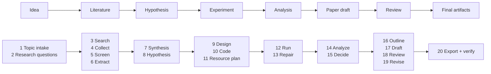

# ThesisKit

> **Citation-verified academic research automation — from idea to draft.**

ThesisKit is an alpha-stage Python toolkit for turning a research topic into an
inspectable paper draft with verified citation metadata, reproducible experiment
artifacts, and review notes you can audit before trusting.

It is not a magic “paper generator.” The goal is narrower and more useful:
make every citation, experiment number, and review decision traceable.

## Quick start

ThesisKit is not published on PyPI yet. Install from source:

```bash
git clone https://github.com/sodiptabadiabanurea/thesiskit.git
cd thesiskit
python -m venv .venv
source .venv/bin/activate
pip install -e ".[dev]"
pytest -q
```

Run the CLI from a local checkout:

```bash
thesiskit run --topic "retrieval-augmented generation for small research teams" --auto-approve --output artifacts/demo-run
```

Copy the checked-in mini-run artifacts into your own workspace:

```bash
thesiskit example mini-run --output artifacts/mini-run
```

> **Alpha status:** ThesisKit is actively developed. The checked-in tests and
> `examples/mini-run/` demonstrate the current artifact shape, but the project
> is not claiming production-grade automation or real conference acceptance.

## Mini-run example

Start here if you want to see the intended output before running anything:

```text
examples/mini-run/
├── README.md
├── input/topic.txt
├── citations/papers.json
├── citations/verification_report.md
├── citations/references.bib
├── experiment/config.yaml
├── experiment/results.json
├── draft/paper.md
└── verification/full_report.md
```

The mini-run uses this topic:

```text
retrieval-augmented generation for small research teams
```

It includes three real, resolvable arXiv citations:

| Paper | Source |
|---|---|
| Lewis et al., 2020 — *Retrieval-Augmented Generation for Knowledge-Intensive NLP Tasks* | arXiv:2005.11401 / DOI:10.48550/arXiv.2005.11401 |
| Gao et al., 2023 — *Retrieval-Augmented Generation for Large Language Models: A Survey* | arXiv:2312.10997 / DOI:10.48550/arXiv.2312.10997 |
| Ram et al., 2023 — *In-Context Retrieval-Augmented Language Models* | arXiv:2302.00083 / DOI:10.48550/arXiv.2302.00083 |

The experiment in the example is intentionally synthetic and deterministic
(`seed: 42`). It is meant to show the output schema and verification gates, not
to claim a benchmark result.

You can copy the whole bundle with:

```bash
thesiskit example mini-run --output artifacts/mini-run
```

## How it works



The pipeline is organized as **8 phases / 20 stages**:

| Phase | Stages | What happens |
|---|---:|---|
| A: Scoping | 1–2 | Turn a topic into research questions |
| B: Literature | 3–6 | Search, collect, screen, and extract from source papers |
| C: Synthesis | 7–8 | Cluster findings and propose testable hypotheses |
| D: Design | 9–11 | Design experiments, generate code, and plan resources |
| E: Execution | 12–13 | Run experiments and repair failures when possible |
| F: Analysis | 14–15 | Analyze results and decide proceed/refine/pivot |
| G: Writing | 16–19 | Outline, draft, review, and revise |
| H: Finalization | 20 | Export artifacts and verify citations/results |

## What is implemented vs roadmap

| Implemented in the current alpha | Roadmap / not guaranteed yet |
|---|---|
| arXiv, Semantic Scholar, and citation verification data structures | Broader source support such as PubMed and ACL Anthology |
| Citation verifier for arXiv ID, DOI, URL, and title matching | Stronger automated relevance scoring and deduplication |
| Experiment sandbox primitives | Hardened Docker/Firecracker-style isolation |
| NeurIPS, ICML, and ICLR template modules | Additional templates such as ACL, EMNLP, CVPR, AAAI |
| Multi-agent review scaffolding | Human-in-the-loop review gates and web dashboard |
| Checked-in mini-run artifact example | Production benchmark suite across real research tasks |

## Comparison

| Capability | ThesisKit | Elicit | PaperQA | AI Scientist |
|---|---|---|---|---|
| Primary workflow | Topic → draft artifacts | Literature discovery | Question answering over papers | Automated idea/experiment loop |
| Citation source integration | arXiv / Semantic Scholar / DOI metadata | Yes | Yes | Limited / varies |
| Citation verification report | Yes, explicit artifact | Not the main focus | Partial/source-grounded | Not the main focus |
| Experiment sandbox | Yes, alpha | No | No | Yes |
| LaTeX template export | Yes, draft quality | No | No | Partial / varies |
| Multi-agent review | Yes, alpha | No | No | Yes |
| Best fit | Auditable research draft pipeline | Finding papers | Asking questions over documents | Autonomous experiment generation |

This table is positioning, not a benchmark. The point of ThesisKit is the
traceable artifact bundle: citations, experiment outputs, draft, reviews, and
verification report in one run directory.

## Configuration

Minimal `config.yaml`:

```yaml
project:
  name: "my-research"

research:
  topic: "Your topic here"

llm:
  provider: "openai-compatible"
  base_url: "https://api.openai.com/v1"
  api_key_env: "OPENAI_API_KEY"
  primary_model: "gpt-4o"

experiment:
  mode: "sandbox"
  sandbox:
    python_path: ".venv/bin/python"
```

### Use your own LLM backend

```yaml
# OpenAI-compatible endpoint
llm:
  provider: "openai-compatible"
  base_url: "https://api.openai.com/v1"
  api_key_env: "OPENAI_API_KEY"

# Anthropic
llm:
  provider: "anthropic"
  api_key_env: "ANTHROPIC_API_KEY"

# Local models through Ollama/vLLM/etc.
llm:
  provider: "openai-compatible"
  base_url: "http://localhost:11434/v1"

# ACP-style agent integration, e.g. Codex/Claude Code wrappers
llm:
  provider: "acp"
  acp:
    agent: "codex"
```

## Output structure

A full run is expected to create an artifact directory like:

```text
artifacts/run-YYYYMMDD-HHMMSS/
├── paper_draft.md
├── deliverables/
│   ├── paper.tex
│   ├── references.bib
│   └── charts/
├── experiment_runs/
├── verification_report.json
└── reviews.md
```

The exact contents will evolve while the project is alpha. The rule is stable:
outputs should be inspectable, reproducible where possible, and honest about
which claims are verified.

## Development

```bash
python -m venv .venv
source .venv/bin/activate
pip install -e ".[dev]"
pytest -q
```

Useful targeted checks:

```bash
pytest tests/test_examples.py -q
pytest tests/test_literature.py -q
```

## Roadmap

- [ ] Browser-based paper collection
- [ ] Obsidian knowledge base integration
- [ ] Parallel stage execution
- [ ] More conference templates: CVPR, ACL, EMNLP, AAAI
- [ ] Web UI for monitoring runs
- [ ] Hardened experiment sandboxing
- [ ] Reproducibility bundles with locked dependencies and container metadata

## Contributing

Contributions welcome. Good first areas:

- More literature sources and resolvers
- Stronger citation verification reports
- More realistic mini-run examples
- Additional conference templates
- Better sandboxing and failure recovery
- CLI and documentation cleanup

Please keep claims auditable. If a feature cannot be verified by tests or a
checked-in example, document it as roadmap rather than implemented behavior.

## License

MIT

## Citation

If you use ThesisKit in your research:

```bibtex
@misc{thesiskit2026,
  author = {ThesisKit Contributors},
  title = {ThesisKit: Citation-Verified Academic Research Automation},
  year = {2026},
  url = {https://github.com/sodiptabadiabanurea/thesiskit},
}
```
